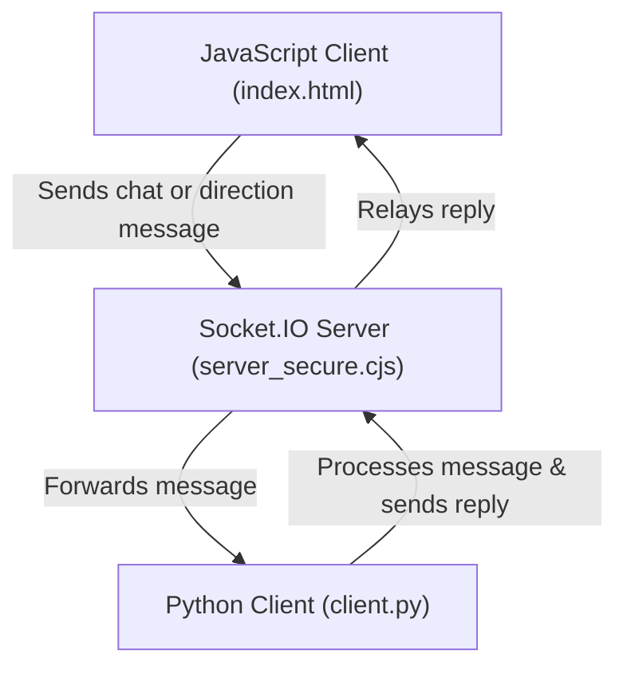

# A Simple Browser - Using `socket.io`
## Introduction
Socket.IO is a library that enables **low-latency, bidirectional, and event-based communication** between a client and a server. 


To get started, you need to have a few things installed on your system.

---

## 1. Prerequisites

### Node.js
- **Download**: [Node.js official website](https://nodejs.org/)
- **Installation Steps**:
  1. Download the **LTS (Long-Term Support)** version.
  2. Run the installer and follow the instructions.
  3. Verify installation:
     ```sh
     node -v
     ```

### Python (Required for Python-based Socket.IO applications)
- **Download**: [Python official website](https://www.python.org/downloads/)
- **Installation Steps**:
  1. Install Python and ensure **"Add Python to PATH"** is checked.
  2. Verify installation:
     ```sh
     python --version
     ```

### Or, Install Anaconda (Alternative to Python Installation)
- **Download**: [Anaconda official website](https://www.anaconda.com/download)
- Anaconda is useful for managing multiple Python versions and virtual environments.
- Verify installation:
  ```sh
  conda --version
  ```

---

## 2. Creating a Virtual Environment in Python or Conda

### **Using Python (`venv`)**

#### **Windows**
1. Open **Command Prompt (cmd)** or **PowerShell**.
2. Navigate to your project directory:
   ```sh
   cd path/to/your/project
   ```
3. Create a virtual environment:
   ```sh
   python -m venv myenv
   ```
4. Activate the virtual environment:
   ```sh
   myenv\Scripts\activate
   ```
5. Install dependencies (example: Socket.IO):
   ```sh
   pip install python-socketio
   ```
6. To deactivate:
   ```sh
   deactivate
   ```

#### **macOS/Linux**
1. Open **Terminal**.
2. Navigate to your project directory:
   ```sh
   cd path/to/your/project
   ```
3. Create a virtual environment:
   ```sh
   python3 -m venv myenv
   ```
4. Activate the virtual environment:
   ```sh
   source myenv/bin/activate
   ```
5. Install dependencies:
   ```sh
   pip install python-socketio
   ```
6. To deactivate:
   ```sh
   deactivate
   ```

---

### **Using Conda (Windows & macOS)**
1. Open **Anaconda Prompt (Windows)** or **Terminal (macOS/Linux)**.
2. Create a new Conda environment named `myenv`:
   ```sh
   conda create --name myenv python=3.11
   ```
3. Activate the environment:
   ```sh
   conda activate myenv
   ```
4. Install required dependencies:
   ```sh
   pip install python-socketio
   ```
5. Verify installation:
   ```sh
   python --version
   pip list
   ```
6. To deactivate:
   ```sh
   conda deactivate
   ```
7. To remove the environment:
   ```sh
   conda remove --name myenv --all
   ```

---

## 3. Clone or Download the Repository

### Install Git

Before proceeding, ensure you have Git installed:
- **Windows**: [Download Git for Windows](https://git-scm.com/downloads/win) and follow the installation instructions.
- **macOS**: Git is pre-installed on most macOS systems. To check, open **Terminal** and run:
  ```sh
  git --version
  ```
  If Git is not installed, install via Homebrew:
  ```sh
  brew install git
  ```

### Downloading the Repository

The easiest way to get this code is to:
1. Visit [GitHub Repository](https://github.com/IE-482-582/spring2025)
2. Click the green **`Code`** button
3. Select **Download ZIP** and extract it to your desired location.

### Cloning the Repository

If you're comfortable using the command line, navigate to the directory where you want to save the repository and run:

```sh
git clone https://github.com/IE-482-582/spring2025.git
```

---

## 4. Running the Scripts

You will need **two terminal windows**. In both, change directories to the `simple_browser_socket` folder.

- **Terminal 1** (Runs the server):
  ```sh
  node server_secure.cjs --public
  ```

- **Terminal 2** (Runs the client):
- Activate a virtual environment so all the project related packages can be available in the environment and not system wide since you might not need them.
  ```sh
  python3 client.py
  ```


If you encounter errors related to missing Python packages, install them:
```sh
pip install python-socketio
pip install websocket-client
```


Once you get that working without errors open your browser and visit:
```
https://localhost:8080/index.html
```

---

## 5. How These Files Interact



The `client.py` and `index.html` interact via **Socket.IO**, enabling real-time communication:

- **Python Client (`client.py`)**:
  - Initializes a **Socket.IO client** and connects to `localhost:8080`.
  - Listens for `"chat"` and `"direction"` events.
  - When a message is received, it processes it and may send a reply.

- **JavaScript Client (`index.html`)**:
  - Loads the Socket.IO client library and establishes a connection to the server.
  - Sends `"chat"` or `"direction"` messages when triggered by user input.
  - Listens for `"reply"` messages from the server and updates the UI.

- **Socket.IO Server (`server_secure.cjs`)**:
  - Acts as a central hub, relaying messages between `client.py` and `index.html`.
  - Receives messages from the browser and forwards them to `client.py`, and vice versa.
